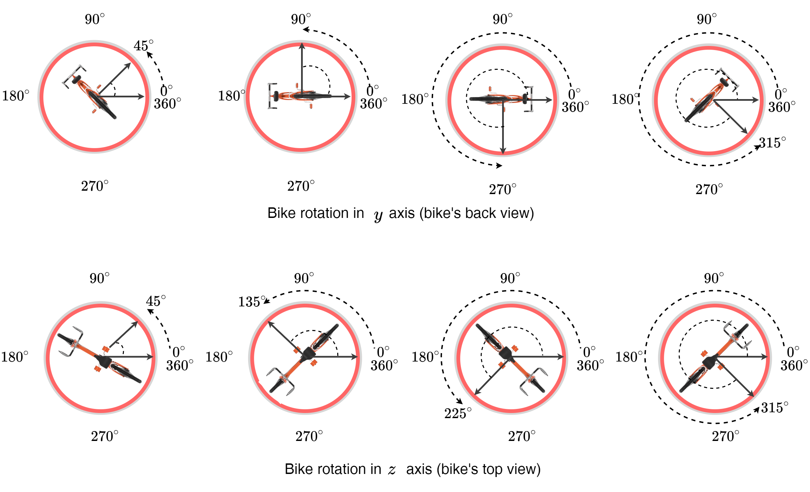

# Synthetic Bike Rotation Dataset (SynthBRSet)
### [Paper](https://arxiv.org/abs/xxxx.xxxxx) | [Supplementary](https://arxiv.org/abs/xxxx.xxxxx) | [Website](https://saghiralfasly.github.io/OSRE/) | [Code](https://github.com/saghiralfasly/OSRE) | [Video demo](https://youtube.com) | [Bike.blend](https://googledrive.com) 


This repository includes the code for generating the synthetic bike rotation dataset (SynthBRSet) using the 3D graphics software [Blender](https://www.blender.org/download/) . This dataset is used to train the bike rotation estimator OSRE proposed in ["**OSRE: Object-to-Spot Rotation Estimation for Bike Parking Assessment**"](https://arxiv.org/abs/xxx)

## Overview
The proposed algorithm leverages the power of 3D computer graphics to generate a large and diverse dataset for training bike rotation estimator for bike parking assessment. By using 3D graphics software, the algorithm is able to accurately annotate the rotations of bikes with respect to the parking spot area in two axes $y$ and $z$, which is crucial for training models for visual object-to-spot rotation estimation. Additionally, the ease of building the algorithm in Python made the generated dataset diverse with a wide range of variations in terms of parking space, lighting conditions, backgrounds, material textures, and colors, as well as objects and camera angles, to improve the generalization of the trained model. Overall, the use of 3D computer graphics allows for the efficient and precise generation of visual data for this task as well as for many potential tasks in computer vision.

<br/> 
<p float="left"> 
 
</p>  


## Rotation Annotation
In the first row of the bellow figure - back view, the bike's predicted rotation in $y$ axis with respect to the parking area. This camera view (back view) is obtained when the camera is located in the lower location of its vertical path $z$. Note, we normalized this rotation into only $ 3 $ states: $0^\circ$ represents the standing ```well-parked``` state in $y$ axis, whereas $90^\circ$ and $-90^\circ$ represent the bike ```fallen``` state in the right and the left side, respectively. On the second row, top view. The bike's predicted rotation in $z$ axis with respect to the parking area. This camera view (top view) is obtained when the camera is located in the middle location of its horizontal path $x$.
<br/> 
<p float="left"> 
 
</p> 

## Code Setup

The generated dataset will be in Yolo annotation formate. It involves the rotation annotation of each bike. The code creates COCO annotation as well.Overall, the dataset includes the **images** and **annotations** directories as in [SynthBPSet](https://github.com/saghiralfasly/SynthBRSet/tree/main/DATASET/SynthBPSet). It is expected to have the generated synthetic dataset in the following dirctory structure:

```
SynthBRSet
│   images
│       └─000001.jpg
│       └─000002.jpg
│       └─000003.jpg
|   labels
│       └─000001.txt
│       └─000002.txt
│       └─000003.txt


```
Each line of each annotation file includes the rotation annotation of the bicycle in two axes $y$ and $z$. Rotations are read in radian, then normalization into `[0-1]`.
```
Example the annotation file 006444.txt:

cls    x        y        w        h        θy       θz
 1   0.533666 0.539923 0.028769 0.156479 0.500000 0.482248


```

The ```cls``` represents the classes of the bike instance. We use three classes ```0, 1, and 2``` that represent ```parked, rotated, and fallen```, respectively. In more details, when a bike is rotated in $y$, it could be either $72$ or $-75^\circ$ ($-75^\circ$ represents $288^\circ$) in degrees. More details can be found in the code ```config``` and ```generateData.py```.

#### Running the Code
* Make sure you have downloaded and installed [Blender](https://www.blender.org/download/). Recommended to use linux as this repository is built and run on linux. 
* Download the blender file [Bike.blend](https://googledrive.com), which contains all 3D objects, materials, and default settings. 
* Locate ```Bike.blend``` in the same directory of ```SynthBRSet```.
* Run the following command (supposing that the ```SynthBRSet``` is located in the same directory of ```Blender``` software):

```
../blender -b Bike.blend -P generateData.py
```

**Note**: 
* Depending on the used python enviromenet, it may be required to install some missing packages.
* This code with minor changes can be eaisly used to generate 3D-graphics-based visual dataset for several applications. 

## Citation 
```
@article{alfasly2023OSRE,
  title={OSRE: Object-to-Spot Rotation Estimation for Bike Parking Assessment},
  author={Saghir, Alfasly and Zaid, Al-huda and Saifullah, Bello and Ahmed, Elazab and Jian, Lu and Chen Xu},
  journal={arXiv preprint arXiv:xxxx.xxxxx},
  year={2023}
}
```

